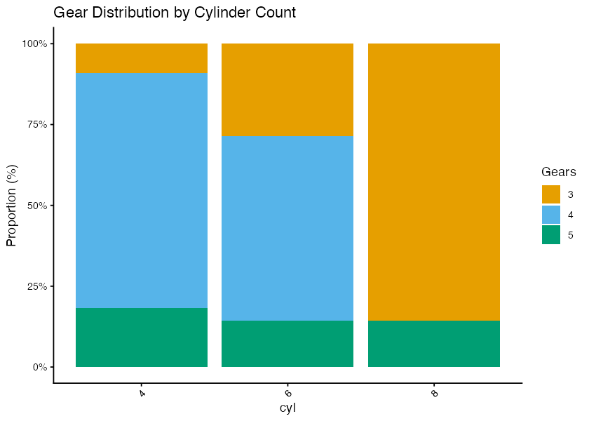
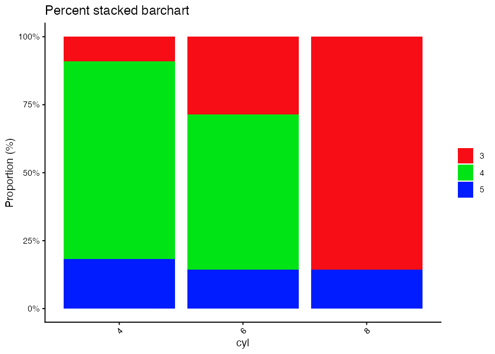

# nvutils

<!-- badges: start -->
<!-- badges: end -->

nvutils is a collection of R utility functions.

## Installation

You can install the development version of nvutils like so:

``` r
devtools::install_github("pcantalupo/nvutils")
```

## Example

Converting an Excel file to TSV.

``` r
library(nvutils)
## basic example code to convert XLSX to TSV
xlsx2tsv(xlsxfile, tsvoutfile)
```

## Nicely-formatted Excel output

`write_xlsx_pretty()` writes a single data frame to an XLSX with `openxlsx`,
fixing the default formatting: left/top cell alignment, auto column widths,
character columns forced to text format (so values like `001` keep their
leading zeros), dates shown as `YYYY-MM-DD`, an initial worksheet zoom, and a
large default window size.

``` r
library(nvutils)
write_xlsx_pretty(mtcars, "mtcars.xlsx", rownames_col = "model")

## a column mixing numeric percentages with text: 0.9 is written as the number
## 90% while "<90%" stays as text
df <- data.frame(id = 1:2, Chemo_Response = c("0.9", "<90%"))
write_xlsx_pretty(df, "response.xlsx", pct_cols = "Chemo_Response")
```

Arguments: `df`, `path`, `sheet` (worksheet name), `zoom`, `rownames_col`
(move row names into a first column), `window_width`, `window_height`, and
`pct_cols` (columns mixing numeric percentages with free text). Returns
invisible `NULL`; called for the side effect of writing the file.

### Command-line usage

`inst/scripts/write_xlsx_pretty.R` wraps the function as a CLI tool that reads
a tabular file (`.tsv`, `.txt`, or `.xlsx`, auto-detected by extension) and
writes a prettified `.xlsx`.

``` sh
## TSV in, prettified xlsx out (defaults to in_pretty.xlsx)
write_xlsx_pretty.R -i data.tsv --pct_cols Chemo_Response

## xlsx in, explicit output
write_xlsx_pretty.R -i data.xlsx -o data_pretty.xlsx
```

Required flag: `-i/--input`. Optional flags: `-o/--output` (defaults to the
input basename + `_pretty.xlsx`), `--sheet` (sheet number to read from an xlsx
input), `--rownames_col`, `--pct_cols` (comma-separated column names),
`--zoom`, and `--infer_types`. For an `.xlsx` input with more than one
worksheet, the script errors unless `--sheet` is given, so no data is dropped
silently.

By default, `.tsv`/`.txt` inputs are read with every column as text, which
preserves leading zeros (e.g. ID `001`) but stores numeric columns as text in
the resulting workbook. Pass `--infer_types` to let `fread` infer column types
so numeric columns are written as real numbers; note that leading zeros in
ID-like columns may then be lost.

## Two-category bar plot

`two_category_barplot()` makes a 100% stacked bar chart showing the
proportional breakdown of a subcategory within each level of a main
category. It takes a plain data frame and two column names, so it works on
any tabular data, not just single-cell metadata.

``` r
library(nvutils)
## proportion of gears within each cylinder count (mtcars is a base dataset)
two_category_barplot(mtcars, category = "cyl", subcategory = "gear")

## with a custom title and legend label
two_category_barplot(mtcars,
                     category = "cyl",
                     subcategory = "gear",
                     title = "Gear Distribution by Cylinder Count",
                     legend_title = "Gears")
```



``` r
## with a different palette (defaults to colors_ditto)
two_category_barplot(mtcars,
                     category = "cyl",
                     subcategory = "gear",
                     colors = colors_polychrome)
```



Arguments: `data` (data frame), `category` (x-axis column), `subcategory`
(fill column), `title`, `legend_title`, and `colors` (fill palette, defaults
to the exported `colors_ditto`; pass any color vector, e.g. `colors_polychrome`).
Returns a ggplot2 object.

### Command-line usage

`inst/scripts/two_category_barplot.R` wraps the function as a CLI tool that
reads a tabular file (`.tsv`, `.txt`, or `.xlsx`, auto-detected by extension)
and saves a PNG.

``` sh
two_category_barplot.R -i data.tsv -c cyl -s gear -o plot.png

## with the polychrome palette and a custom title
two_category_barplot.R -i data.tsv -c cyl -s gear -o plot.png \
  --colors polychrome -t "Gear Distribution by Cylinder Count"
```

Required flags: `-i/--input`, `-c/--category`, `-s/--subcategory`. Optional
flags: `-o/--output` (defaults to the input basename + `.png`), `-t/--title`,
`-l/--legend-title`, `--colors` (`ditto` (default) or `polychrome`), `--theme`
(ggplot2 theme; `grey` is the ggplot2 default, script default is `classic`),
`--rotatex_angle` (x-label rotation, default 45), `--sheet` (xlsx sheet, default
1), `--width`/`--height` (inches, default 7x7), and `--dpi` (default 300).

This is a general-purpose extraction of the `get_barplots_and_tables()`
function in [sctools](https://github.com/pcantalupo/sctools). The sctools
version is single-cell oriented (reads a Seurat/SCE object) and produces a
fuller set of outputs: grouped, stacked, and percent-stacked barplots,
count and percentage contingency tables, and heatmaps. `two_category_barplot()`
keeps only the percent-stacked plot, drops the single-cell coupling, and
adds title/legend arguments and input validation.

